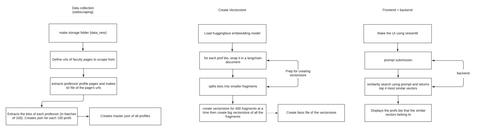

## Original from [Madhavs Repo](https://github.com/Madhav-Malhotra/uwaterloo-prof-finder)

## UWaterloo Prof Finder

This is an unofficial tool to help contact the right Prof at the University of Waterloo. It notes your areas of interest conceptually and compares those to the bios of profs at the University. I made it because I was really struggling to find profs to contact while running clubs since the [existing prof directory](https://experts.uwaterloo.ca/) relies on hyper-specific-keyword search.

Technically, it's implemented using word embeddings in a vector store. This just means that you don't need to know specialised research buzz words to find the right person to work with. 




### Installation
**You'll need a HuggingFace API token to run this app**. HuggingFace describes [how to get an API token here](https://huggingface.co/docs/api-inference/quicktour#get-your-api-token).

Go to your folder of choice where you want to store this repo, and run `git clone https://github.com/jogong2718/prof-finder.git` on your terminal to download the Git Respository onto your computer. Then, run `cd uwaterloo-prof-finder`to open the downloaded folder. 


# Unix based OS (MacOS or Linux)
Run `python3 -m venv venv` to create a virtual environment. Then, activate the virtual environment with `source venv/bin/activate`. Next, install project dependencies with `pip3 install -r requirements.txt`

# Windows
Run `python -m venv venv` to create a virtual environment. Then, activate the virtual environment with `venv/scripts/activate`. Next, install project dependencies with `pip install -r requirements.txt`

Create a file called `.env` in the downloaded folder and enter your HuggingFace API Token: 
```.env
HUGGINGFACEHUB_API_TOKEN=YourTokenHere
```

Finally, run `streamlit run frontend.py`
