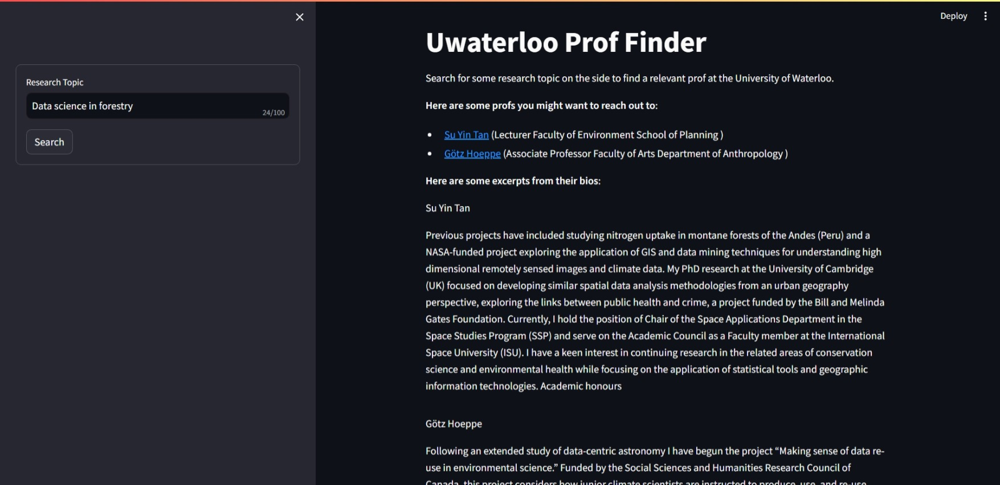

## UWaterloo Prof Finder

This is an unofficial tool to help contact the right Prof at the University of Waterloo. It notes your areas of interest conceptually and compares those to the bios of profs at the University.

Technically, it's implemented using word embeddings in a vector store. This just means that you don't need to know specialised research buzz words to find the right person to work with. 



### Installation
**You'll need a HuggingFace API token to run this app**. HuggingFace describes [how to get an API token here](https://huggingface.co/docs/api-inference/quicktour#get-your-api-token).

Run `git clone https://github.com/Madhav-Malhotra/uwaterloo-prof-finder` on your terminal to download the Git Respository onto your computer. Then, run `cd uwaterloo-prof-finder`to open the downloaded folder. 

Run `python3 -m venv .venv` to create a virtual environment. Then, activate the virtual environment with `source .venv/bin/activate`. Next, install project dependencies with `pip3 install requirements.txt`

Create a file called `.env` in the downloaded folder and enter your HuggingFace API Token: 
```.env
HUGGINGFACEHUB_API_TOKEN=YourTokenHere
```

Finally, run `streamlit run frontend.py`